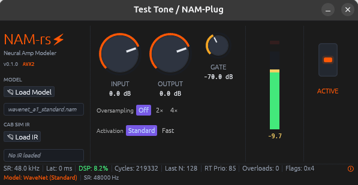

<!--
SPDX-License-Identifier: GPL-3.0-or-later
Copyright (c) 2026 Fábio Henrique de Lima Silva (fhl.bsb@gmail.com) All rights reserved.
-->

# NAM-Plug

       

**NAM-Plug** is a high-performance, ultra-low latency CLAP (CLever Audio Plug-in) audio plugin for real-time [Neural Amp Modeler (NAM)](https://www.neuralampmodeler.com/) simulation on Linux DAWs.

It directly embeds [`NeuralAmpModeler-rs`](https://github.com/fabiohl/NeuralAmpModeler-rs) as its core neural DSP engine, inheriting all of its real-time guarantees: **zero heap allocations**, **zero locks**, and **zero blocking system calls** on the real-time audio thread, `x86-64-v3` (AVX2/FMA) baseline SIMD vectorization, and exact numerical parity against canonical C++ NAMCore and double-precision f64 reference oracles.

Designed for seamless integration into modern Linux digital audio workstations (DAWs) such as Bitwig Studio, REAPER, Ardour, Tracktion Waveform, and Harrison Mixbus, NAM-Plug offers a vector-rendered `egui` GUI for loading `.nam` neural amp models and `.wav` impulse responses (IRs), gain staging, noise gating, oversampling, anti-aliasing filter configuration, and real-time DSP performance telemetry.

> **❤️‍🔥 NAM-Plug is in active development.** Feedback, bug reports, performance metrics, and DAW compatibility notes are very welcome!

---

## 🎨 Visual Overview & GUI Showcase



*The vector-rendered egui graphical interface running inside a Linux host. The interface features model and cabinet IR selectors, rotary controls for Input/Output gain staging and Noise Gate threshold, toggle selectors for half-band anti-aliasing Oversampling (`Off`, `2x`, `4x`) and Activation precision math (`Standard` vs `Fast`), an active/bypass state indicator, a high-resolution peak level meter, and a real-time DSP telemetry status bar.*

---

## ⚡ Key Strengths & Architectural Highlights

* **Native CLAP 1.2+ Standard Integration:** Built on top of the `clack` framework, exposing a clean, robust implementation of the CLever Audio Plug-in (CLAP) standard with zero translation overhead, sample-accurate parameter automation, and native host extension compliance (`audio-ports`, `params`, `state`, `state-context`, `latency`, `gui`, `track-info`, `remote-controls`, `param-indication`, `preset-discovery`, `render`, `tail`, `log`).
* **Inherited Neural Engine Excellence:** Powered by [`NeuralAmpModeler-rs`](https://github.com/fabiohl/NeuralAmpModeler-rs), supporting WaveNet (A1/A2 standard & slimmable profiles), LSTM (1-layer and 2-layer topologies), ConvNet, Linear FIR, and partitioned FFT speaker cabinet impulse responses (.wav).
* **Strict Zero-Allocation RT Safety & 3-Tier GC Cascade:** The audio callback thread runs with strict real-time determinism — no heap allocations, no mutex locks, and no blocking I/O on the hot path. Dropped models, IRs, and oversamplers cascade through lock-free SPSC channels (32 slots) → processor parking lot (16 slots) → atomic overflow ring buffer with poison-resilient rollback guards (`ActivateRollbackGuard`).
* **Branchless FMA-Optimized Bypass Crossfader:** 32 ms equal-power crossfade blending during bypass transitions, executing branchlessly with FMA vectorization and adaptive handling of fractional phase discrepancies between dry capture and resampled wet streams.
* **Cold-Path Latency Caching & Dynamic PDC:** Effective latency (resampler + oversample + cab-sim) is cached on the audio thread and recomputed strictly during cold asset swaps, driving instant DAW Plugin Delay Compensation (`clap_plugin_latency`) without per-block audio thread overhead.
* **Decoupled Gain Staging & Model Calibration:** Embedded model loudness metadata calibration (`input_mult_adj`/`output_mult_adj`) is isolated from sample-accurate DAW user-gain automation (`ParamSmoother`), preventing automation sweeps from altering static model calibration multipliers.
* **Generation-Counter Fast Path (`gui_param_generation`):** Eliminates redundant atomic float loads when parameters are stationary, reading parameter targets only upon modification.
* **Hardware-Accelerated egui + Glow GUI with 2-Tier Idle Throttling:** Vector-rendered OpenGL UI (`egui 0.36` + `glow 0.17` + `baseview`) featuring adaptive mono/stereo tricolor VU meters with custom GLSL shaders, sub-pixel peak-hold indicators, and an idle skip engine (CLAP-F022) achieving 0% GPU/CPU overhead when static.
* **Half-Band Anti-Aliasing Oversampling:** Optional `2x` and `4x` polyphase oversampling centered around the neural inference stage to eliminate high-frequency aliasing foldover in high-gain amp models.
* **Selectable Activation Precision:** Supports both `Standard` (exact-grade, default) and `Fast` (Padé polynomial minimax approximations) math modes to balance precision against CPU consumption on demanding setups.
* **Real-Time DSP Telemetry & Diagnostics:** Live footer display reporting sample rate (`SR`), buffer latency (`Lat`), DSP CPU load percentage (`DSP %`), CPU cycles per block, block size (`Last N`), real-time thread priority (`RT Prio`), overload xrun count, and diagnostic status flags (`Flags`).
* **5-Phase Advanced Optimization Pipeline (PGO + LLVM-BOLT):** Automated compilation suite (`build-release.sh`) leveraging synthetic neural DSP profiling, Profile-Guided Optimization (PGO), and LLVM-BOLT machine code layout optimization to maximize Instruction Cache locality.
* **Linker-Level Symbol Isolation:** Scoped version script (`hide-libm-shadow.map`) ensuring libm symbols resolve dynamically to `glibc` without dangerous PLT/GOT self-referential loops in release builds.

---

## 🥊 Feature Showcase ("Roofshoot")

| Feature / Attribute            | Technical Implementation                                                 | Benefit & Impact                                                   |
|:------------------------------ |:------------------------------------------------------------------------ |:------------------------------------------------------------------ |
| **Inference Engine**           | Core `NeuralAmpModeler-rs` engine (WaveNet A1/A2, LSTM, ConvNet, Linear) | Full model compatibility with exact C++ f32 & f64 reference parity |
| **Plugin Standard**            | Native CLAP API wrapper (`clack-plugin` & `clack-extensions`)            | Sub-millisecond buffer sizes and sample-accurate DAW automation    |
| **RT Determinism**             | Strict Zero Heap Drop, Zero Locks, Zero Hot-Path Logging                 | Guaranteed audio stability without buffer underruns (xruns)        |
| **SIMD Hardware Acceleration** | Mandatory `x86-64-v3` (AVX2/FMA) baseline + AVX-512 multiversioning      | Ultra-low CPU usage (< 8.2% of CPU deadline on typical blocks)     |
| **Bypass Crossfader**          | 32 ms equal-power crossfade with branchless FMA loop & phase compensation| Smooth, pop-free bypass transitions with zero phase cancellation   |
| **Dynamic Latency (PDC)**      | Cold-path cached effective latency with dynamic `clap_plugin_latency`    | Instant host Plugin Delay Compensation with 0 per-block overhead   |
| **Cabinet IR Convolution**     | Partitioned FFT & Direct FIR convolution engine (.wav IRs)               | Seamless, zero-latency speaker cabinet simulation                  |
| **Graphical User Interface**   | `egui 0.36` vector UI with `glow 0.17` (OpenGL 3.3) via `baseview`       | Responsive, framerate-independent UI with GLSL shader meters       |
| **GUI Idle Throttling**        | 2-tier frame lifecycle & dirty-state early exit (CLAP-F022)              | 0% GPU/CPU consumption when plugin UI is open and stationary       |
| **Oversampling**               | Half-band polyphase FIR filters (`Off`, `2x`, `4x`)                      | Eliminates aliasing distortion in high-gain amp models             |
| **Activation Precision**       | `Standard` (exact-grade, default) vs `Fast` (Padé approximations)        | User-selectable trade-off between math precision and CPU latency   |
| **CLAP State Persistence**     | Lock-free atomic synchronization & JSON serialization                    | Full preset saving/loading and seamless DAW project restoration    |
| **Diagnostics & Telemetry**    | Atomic telemetry bitmask & `LogBuffer` ring buffer integration           | Real-time CPU, latency, overload, and flag telemetry in GUI footer |
| **Release Optimization**       | 5-phase PGO + LLVM-BOLT pipeline with demangled assembly report          | Minimized I-Cache misses and maximum instruction throughput        |

---

## 🛠️ System Prerequisites

| Dependency                | Minimum Version                               | Package / Command     |
|:------------------------- |:--------------------------------------------- |:--------------------- |
| **Linux Kernel**          | ≥ 5.10                                        | `uname -r`            |
| **Rust Toolchain**        | ≥ 1.85 (edition 2024)                         | `rustc --version`     |
| **CPU Architecture**      | `x86_64` with AVX2/FMA (`x86-64-v3` baseline) | `lscpu`               |
| **CLAP Host / DAW**       | Bitwig, REAPER, Ardour, Qtractor, Carla, etc. | Host application      |
| **Development Libraries** | `build-essential`, `pkg-config`, `cmake`, GL  | See apt command below |

### Installation of System Dependencies (Debian / Ubuntu / Pop!_OS)

```bash
sudo apt update && sudo apt install -y build-essential pkg-config cmake libgl1-mesa-dev libx11-dev libxcursor-dev libxcb1-dev libxkbcommon-dev
```

---

## 🚀 Building & Installation

### 1. Direct Shared Library Build (`cargo build`)

For standard plugin compilation:

```bash
cargo build --release
```

The resulting shared library will be placed at `target/release/libnam_plug.so`.

To install the plugin into your user CLAP directory:

```bash
mkdir -p ~/.clap
cp target/release/libnam_plug.so ~/.clap/nam_plug.clap
```

For development and host-harness testing support:

```bash
cargo build --features testing
```

---

### 2. Mega-Optimized Compiler Build (`./utils/build-release.sh`)

For maximum performance in live and studio DAW environments, `NAM-Plug` includes a 5-phase optimization pipeline leveraging **Profile-Guided Optimization (PGO)** and **LLVM BOLT** (Binary Optimization and Layout Tool).

```bash
./utils/build-release.sh
```

#### What `build-release.sh` does under the hood

1. **Phase 1 — Environment Verification:** Validates toolchain prerequisites (`rustc`, `cargo`, `python3`, `tar`, `zstd`, `flatpak`, `llvm-profdata`, `llvm-bolt`, and `perf`) and verifies target CPU flags from `.cargo/config.toml`.
2. **Phase 2 — PGO Trace Generation:** Compiles `pgo_profiling_workload` with `-Cprofile-generate`, executing synthetic neural DSP workloads to collect realistic CPU performance profiles (`.profraw`), merging them into `merged.profdata`.
3. **Phase 3 — PGO-Optimized Compilation:** Recompiles `libnam_plug.so` using `-Cprofile-use=merged.profdata` and relocation symbols (`-Clink-arg=-Wl,-q`), allowing LLVM to optimize hot loops, inline activation functions, and unroll vector SIMD loops.
4. **Phase 4 — LLVM BOLT Machine Code Reordering:** Reorders machine code instructions via `llvm-bolt` to minimize Instruction Cache (I-Cache) misses and TLB pressure during real-time processing.
5. **Phase 4.5 — Assembly Hotspot Disassembly Report:** Outputs an AI-ready demangled disassembly report at `target/dsp_hotpath.asm`.
6. **Phase 5 — Automated Deployment:** Strips and installs the finalized, hyper-optimized plugin directly to `~/.clap/nam_plug.clap`.
7. **Phase 6 — Release Packaging (.tar.zst):** Generates a release distribution archive at `~/nam-plug-vx.y.z-linux-x86_64-v3.tar.zst` containing the plugin, documentation, license, and a 1-click installation script.
8. **Phase 7 — Release Packaging (.flatpak):** Builds and exports the standalone Flatpak plugin extension bundle (`~/nam-plug-vx.y.z-linux-x86_64-v3.flatpak`) with AppStream metadata for sandboxed DAWs (Bitwig, REAPER, Ardour).

#### CLI Options

| Option          | Description                                                                                                     |
|:--------------- |:--------------------------------------------------------------------------------------------------------------- |
| `--install`     | Automatically installs the Flatpak extension locally (`flatpak install --user`) in addition to `~/.clap/`.      |
| `--no-flatpak`  | Skips Phase 7 (Flatpak bundle creation).                                                                        |
| `--no-tarball`  | Skips Phase 6 (.tar.zst archive creation).                                                                      |
| `--no-pgo`      | Skips Phase 2/3 (Profile-Guided Optimization) and compiles directly with the `dist` release profile.            |
| `--no-bolt`     | Skips Phase 4 (LLVM BOLT post-link optimization).                                                               |
| `-h, --help`    | Displays command-line help screen and exits.                                                                    |

---

### 3. Flatpak Plugin Extension Distribution (`.flatpak`)

In addition to traditional shared library installation, `NAM-Plug` is distributed as a standalone **Flatpak Audio Plugin Extension** (`org.freedesktop.LinuxAudio.Plugins.NAMPlug`), targeting the standard `org.freedesktop.LinuxAudio.BaseExtension` runtime point (`branch 25.08`).

This format enables sandboxed Flatpak DAWs (including Bitwig Studio `com.bitwig.BitwigStudio`, REAPER `fm.reaper.Reaper`, Ardour `org.ardour.Ardour`, and Studio One `com.fender.studioapp8`) to seamlessly discover and load `NAM-Plug` without requiring insecure filesystem sandbox holes (`--filesystem=host` or `--filesystem=home`).

#### End-User Installation

Install the `.flatpak` bundle directly into your local user Flatpak repository:

```bash
flatpak install --user --reinstall ~/nam-plug-v0.5.0-linux-x86_64-v3.flatpak
```

#### How DAW Discovery Works in Flatpak

When installed, the plugin binary is mounted inside the DAW container at `/app/extensions/Plugins/clap/nam_plug.clap`. Compatible Flatpak DAWs configured with the `org.freedesktop.LinuxAudio.Plugins` extension point automatically scan this directory on startup and expose `NAM-Plug` directly in their native CLAP plugin browser.

To verify the installed extension files on your system:

```bash
ls -la ~/.local/share/flatpak/runtime/org.freedesktop.LinuxAudio.Plugins.NAMPlug/x86_64/25.08/active/files/clap/
```

#### Developer Workflow (Building & Testing Flatpak Locally)

You can build and package the Flatpak extension bundle locally using either the release pipeline or `flatpak-builder`:

1. **Automated Pipeline Build & Install:**

   ```bash
   ./utils/build-release.sh --install
   ```

2. **Standalone Manifest Compilation via `flatpak-builder`:**

   ```bash
   # Build the release CLAP library first
   cargo build --release

   # Compile and install the extension manifest locally
   flatpak-builder --user --install --force-clean \
     --state-dir=target/flatpak-builder \
     target/flatpak-build \
     packaging/flatpak/org.freedesktop.LinuxAudio.Plugins.NAMPlug.yml
   ```

#### Uninstallation

To remove the Flatpak plugin extension:

```bash
flatpak uninstall --user org.freedesktop.LinuxAudio.Plugins.NAMPlug
```

---

## 🎛️ DAW Usage & Workflow Guide

### 1. Host Scanning & Loading

1. Open your CLAP-compatible DAW (e.g. Bitwig Studio, REAPER, Ardour).
2. Trigger a plugin rescan if required. `NAM-Plug` will appear under your CLAP plugin list as **NAM-Plug** (or **Neural Amp Modeler**).
3. Insert `NAM-Plug` into an audio or guitar track.

### 2. Loading Models & Cabinet IRs

1. **Neural Model:** Click **`Load Model`** in the left panel to select a `.nam` or `.namb` amplifier model file.
2. **Cabinet Impulse Response:** Click **`Load IR`** to load a speaker cabinet `.wav` impulse response.

### 3. Staging & Performance Tuning

1. **Gain Staging:** Use the **`INPUT`** and **`OUTPUT`** rotary knobs to balance signal levels.
2. **Noise Gate:** Adjust the **`GATE`** knob (default `-70.0 dB`) to eliminate hum and background noise when not playing.
3. **Anti-Aliasing Oversampling:** Select **`2x`** or **`4x`** polyphase oversampling when running high-gain amplifier models to eliminate aliasing foldover distortion.
4. **Activation Math Mode:** Switch between **`Standard`** (exact precision) and **`Fast`** (Padé polynomial approximations) to optimize CPU usage on large sessions.
5. **Active / Bypass:** Toggle the **`ACTIVE`** button to bypass or re-engage processing seamlessly with 32 ms equal-power crossfading.

### 4. Telemetry Footer Monitoring

The status bar at the bottom of the plugin GUI provides real-time telemetry:

* **SR:** Host sample rate (e.g., `48.0 kHz`).
* **Lat:** Added latency in samples/ms (e.g., `0 ms` when oversampling is Off).
* **DSP:** Percentage of real-time audio block budget consumed (e.g., `DSP: 8.2%`).
* **Cycles:** Exact CPU cycle count for the last processed block.
* **Last N:** Quantum block size (e.g., `128` samples).
* **RT Prio:** Operating system real-time thread priority (e.g., `85`).
* **Overloads:** Count of detected audio buffer overruns/underruns (xruns).
* **Flags:** Atomic diagnostic bitmask status.

---

## ⚠️ Known Host Limitations & DAW Compatibility

| DAW / Host Environment                                  | Status                  | Compatibility Notes                                                                                                                                                                                                                                                            |
|:------------------------------------------------------- |:----------------------- |:------------------------------------------------------------------------------------------------------------------------------------------------------------------------------------------------------------------------------------------------------------------------------ |
| **Bitwig Studio** (Linux)                               | ✅ Full Support         | Full GUI embedding, sample-accurate automation, state save/restore, and offline bounce.                                                                                                                                                                                        |
| **REAPER** (Native Linux)                               | ✅ Full Support         | Full GUI embedding, parameter automation, and ultra-low latency playback.                                                                                                                                                                                                      |
| **Ardour** / **Harrison Mixbus**                        | ✅ Full Support         | Fully functional CLAP plugin scanning, processing, and automation.                                                                                                                                                                                                             |
| **Carla Plugin Host**                                   | ✅ Full Support         | Works out of the box in bridge and native CLAP rack modes.                                                                                                                                                                                                                     |
| **Tracktion Waveform**                                  | ✅ Full Support         | Full CLAP compatibility and project state recall.                                                                                                                                                                                                                              |
| **PreSonus Studio One** / **Fender Studio Pro** (Linux) | ⚠️ Known GUI Limitation | **Known issue:** Audio DSP processing and CLAP parameter control operate normally, but the host cannot currently initialize or attach the X11/XWayland GUI surface (`baseview` / `egui_glow`). This is a known host-side window management limitation in Studio One for Linux. |

---

## 🧪 CI & QA Automation Suite (`./utils/`)

The `./utils/` directory contains maintainer tools and standard scripts for code quality, CLAP compliance, and continuous integration:

| Script                                             | Purpose & Execution Scope                                                                                                                                                                                                                      |
|:-------------------------------------------------- |:---------------------------------------------------------------------------------------------------------------------------------------------------------------------------------------------------------------------------------------------- |
| [`utils/lints.sh`](utils/lints.sh)                 | **Static Analysis Gate:** Runs `cargo fmt`, compilation checks (`cargo check`), strict `cargo clippy` across feature combinations (`--all-features`, `--no-default-features`), validates SPDX license headers, and checks anti-patterns.       |
| [`utils/tests-quick.sh`](utils/tests-quick.sh)     | **Consolidated QA Suite:** Executes unit tests, host-harness tests, CLAP compliance checks (debug + release), and the RT-safety heap-audit gate (`--features testing,heap-audit`).                                                             |
| [`utils/build-release.sh`](utils/build-release.sh) | **Compiler Optimization Pipeline:** Multi-stage release builder using PGO and LLVM BOLT, outputting assembly report `target/dsp_hotpath.asm`, binary `~/.clap/nam_plug.clap`, and release archive `~/nam-plug-vx.y.z-linux-x86_64-v3.tar.zst`. |

---

## 📚 Architectural & Technical Documentation

The following technical documents are maintained in the source repository:

| Document                                                                                                                         | Primary Focus & Topic Coverage                                                                        |
|:-------------------------------------------------------------------------------------------------------------------------------- |:----------------------------------------------------------------------------------------------------- |
| [`docs/architecture.md`](docs/architecture.md)                                                                                   | CLAP plugin architecture, SPSC GC thread model, egui GUI integration, lock-free state synchronization |
| [`docs/testing.md`](docs/testing.md)                                                                                             | Test suite layout, host-harness verification phases, CLAP test policies, and test coverage matrix     |
| [`docs/functional-tests.md`](docs/functional-tests.md)                                                                           | Plugin functional test checklist and verification matrices                                            |
| [`docs/postmortem-libm-symbol-interposition.md`](docs/postmortem-libm-symbol-interposition.md)                                   | Technical postmortem on libm symbol interposition resolution on Linux dynamic linkers                 |
| [`NeuralAmpModeler-rs: Audio Fidelity Map`](https://github.com/fabiohl/NeuralAmpModeler-rs/blob/main/docs/audio_fidelity_map.md) | DSP decision quality trade-off matrix and frequency response analysis (NeuralAmpModeler-rs engine)    |

---

## 🙏 Credits & Acknowledgments

* **Steven Atkinson** — Creator of [Neural Amp Modeler (NAM)](https://github.com/sdatkinson/neural-amp-modeler) for pioneering deep learning guitar amplifier modeling.
* **Clack Framework & CLAP Community** — For providing the Rust `clack` library and creating the open, modern CLever Audio Plug-in standard.
* **Emilk & egui Community** — For the immediate-mode GUI framework powered by OpenGL.

---

## ⚖️ License & AI Transparency

### AI Transparency Note

The system architecture, real-time safety guarantees, CLAP state management, DSP pipeline design, and GUI implementation are intellectual work (and love) of the maintainer (**Fábio Lima**). Implementation was accelerated through pair programming (*Vibe Coding*) using artificial intelligence models (Gemini, Claude, Grok, DeepSeek and others) within Google Antigravity IDE. IA is just a tool that make wonder in wise hands.

### License

This project is licensed under the **GNU General Public License v3.0 or later** (**GPL-3.0-or-later**). See [LICENSE.txt](LICENSE.txt) for full license details.
