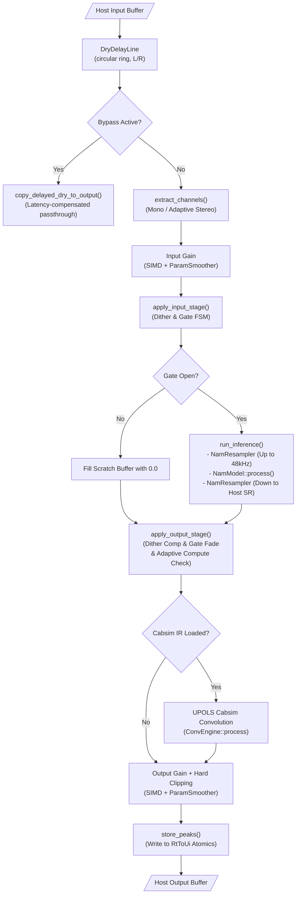

<!--
SPDX-License-Identifier: GPL-3.0-or-later
Copyright (c) 2026 Fábio Henrique de Lima Silva (fhl.bsb@gmail.com) All rights reserved.
-->

# NAM-Plug Architecture: CLAP Plugin

This document is the primary architecture bible and source of truth for **NAM-Plug**, a Neural Amp Modeler (NAM) audio plugin built on the CLAP (CLever Audio Plug-in) specification for Linux.

NAM-Plug wraps the low-latency DSP neural inference engine provided by the [`NeuralAmpModeler-rs`](https://github.com/fabiohl/NeuralAmpModeler-rs) library crate into a production-grade CLAP plugin. It handles plugin lifecycle, DAW parameter automation, lock-free real-time audio processing, state persistence, host extension compliance, and an immediate-mode graphical user interface.

For deep microarchitectural details on neural model execution (WaveNet, LSTM, ConvNet, Linear), SIMD (production AVX2 `x86-64-v3`), resampler sinc math, oversampling half-band FIR filters, or model loading formats (`.nam`/`.namb`), see the core engine documentation in [`NeuralAmpModeler-rs`](https://github.com/fabiohl/NeuralAmpModeler-rs) (`docs/architecture.md` §1.2).

---

## 1. System Topology & Thread Model

NAM-Plug enforces strict thread segregation to guarantee Real-Time (RT) safety during audio processing while supporting interactive UI rendering and host DAW commands.

```text
┌─────────────────────────────────────────────────────────────────────────────┐
│                            DAW Host Environment                             │
└──────┬──────────────────────────────────┬───────────────────────────┬───────┘
       │ (C-ABI Extensions)               │ (process() Callback)      │ (Host Window)
       ▼                                  ▼                           ▼
┌─────────────────────────────┐  ┌─────────────────────────┐  ┌────────────────────────┐
│        Main Thread          │  │    Audio Thread (RT)    │  │       GUI Thread       │
│  - Plugin Lifecycle         │  │  - Hard RT Contract     │  │  - Slint Event Loop    │
│  - Parameter Scanning       │  │  - Zero Heap Alloc      │  │  - "nam-slint-gui"     │
│  - State Save / Load        │  │  - Zero Mutex Locks     │  │  - Slint v1.9 FemtoVG  │
│  - Background Model Loading │  │  - Zero Blocking I/O    │  │  - Wayland & X11       │
│  - GC Tier 1 Disposal       │  │  - DSP Signal Chain     │  │  - Async rfd FileDialog│
│                             │  │                         │  │  - 5-Zone UI Layout    │
└──────────────┬──────────────┘  └────────────▲────────────┘  └───────────┬────────────┘
               │                              │                           │
               │ SPSC Command Queues          │ Atomics & Peak Telemetry  │
               └──────────────────────────────┴───────────────────────────┘
```

### 1.1 Thread Roles & Hard Contracts

- **Main Thread (Host)** — Plugin lifecycle (`init`, `activate`, `deactivate`, `destroy`), parameter scanning, DAW project state save/load, background model (`.nam`/`.namb`) loading, IR reading via `src/clap/plugin/main_thread/load.rs` (using `neural_amp_modeler_rs::dsp::cabsim::loader`), and Tier 1 Garbage Collection disposal.

- **Audio Thread (RT)** — Driven by the host `process()` callback (`PluginAudioProcessor::process` in `src/clap/processor/mod.rs`).

  > **Hard Real-Time Contract:** Zero heap allocations, zero mutex locks, zero blocking I/O, zero panics. Operates directly on host audio buffers using host-driven single-callback processing.

- **GUI Thread** — Dedicated `"nam-slint-gui"` event loop thread running `slint::run_event_loop()` with Slint 1.9 (FemtoVG / winit backend). Fully isolated from the audio thread, synchronizing telemetry at 60 Hz via `SlintViewModel`.

---

## 2. Compilation Strategy & Feature Flags

`NAM-Plug` is a dedicated CLAP plugin crate (`nam-plug` v0.8.0). It compiles into a dynamic shared library (`libnam_plug.so`, installed as `nam_plug.clap`) and auxiliary testing and certification binaries (`pgo_profiling_workload` and `nam_perf_guard` under `src/bin/`, both gated behind the `testing` feature). Standalone PipeWire hosting is handled separately by the sibling subproject `NAM-Audio-Pipe`.

The crate feature flags defined in `Cargo.toml` are:

- **`stereo` (default):** Enables dual-channel L/R audio processing and dynamic adaptive stereo VU metering.
- **`testing`:** Enables internal test utilities, harness helpers, fixture resolution, the `nam_perf_guard` certification binary, and the `pgo_profiling_workload` binary.
- **`heap-audit`:** Activates the allocation counting allocator interceptor (`CountingAllocator`) for RT-safety heap audits.
- **`avx512` (opt-in):** Forwards the engine's opt-in AVX-512 feature to `NeuralAmpModeler-rs` (`avx512 = ["NeuralAmpModeler-rs/avx512"]`), enabling the extended EVEX engine only in explicit feature builds. Off by default: standard and release builds keep the contractual `x86-64-v3` (AVX2/FMA) baseline — engine AVX-512 kernels are isolated at compile time via `cfg(feature = "avx512")`, with no post-link binary scanning.

```bash
# Standard release build (produces target/release/libnam_plug.so)
cargo build --release

# Development and testing build
cargo build --features testing
```

---

## 3. Plugin Descriptor & Parameter Surface

### 3.1 Plugin Descriptor

Returned by `nam_descriptor()` (`src/clap/descriptor.rs`) during host scan without heap allocation:

| Field        | Value                                                              |
|:------------ |:------------------------------------------------------------------ |
| **ID**       | `br.eti.fabiolima.nam-plug`                                        |
| **Name**     | `NAM-Plug`                                                         |
| **Vendor**   | `Fabio Lima`                                                       |
| **URL**      | `https://github.com/fabiohl/NAM-Plug`                              |
| **Features** | `["audio-effect", "distortion", "gate", "mono"]` (CLAP 1.2.2 spec) |

Core DSP neural inference is mono by definition. Buffer extraction and VU metering adapt dynamically to mono or stereo host track configurations.

### 3.2 Parameter Surface Catalog

Exposed via `src/clap/extensions/params/` and synchronized via `src/clap/processor/params.rs` (using engine parameters from `neural_amp_modeler_rs::common::params::RtProcessingParams`). Parameter IDs are `u32` constants (`PARAM_*`, 0–8):

| Parameter                | ID                         | Type    | Range / Options                                                 | Description                                                |
|:------------------------ |:-------------------------- |:------- |:--------------------------------------------------------------- |:---------------------------------------------------------- |
| **Input Gain**           | `input_gain_db` (0)        | dB      | `-20.0` to `+20.0` (default `0.0`)                              | Pre-inference gain, sample-accurate smoothed.              |
| **Output Gain**          | `output_gain_db` (1)       | dB      | `-20.0` to `+20.0` (default `0.0`)                              | Post-inference gain, sample-accurate smoothed.             |
| **Gate Threshold**       | `gate_threshold_db` (2)    | dB      | `-90.0` to `-40.0` (default `-90.0`, off by default)            | Noise-gate opening threshold.                              |
| **Bypass**               | `bypass` (3)               | Binary  | `0.0` (false / default) / `1.0` (true)                          | Disables neural processing (32 ms crossfaded passthrough). |
| **Active Model**         | `active_model` (4)         | String  | `0.0` to `1000.0` (Read-only, default `0.0`)                    | Filename / identification of currently loaded model.       |
| **Adaptive Compute**     | `adaptive_compute` (5)     | Stepped | `0` (`Off`), `1` (`Conservative` / default), `2` (`Aggressive`) | CPU-based dynamic degradation FSM.                         |
| **Slim Override**        | `slim_override` (6)        | Stepped | `0` (`Auto` / default), `1` (`ForceFull`), `2` (`ForceLite`)    | Slimmable A2 container submodel selection.                 |
| **Oversampling**         | `oversample` (7)           | Stepped | `0` (`Off` / default), `1` (`2x`), `2` (`4x`)                   | Activation oversampling factor.                            |
| **Activation Precision** | `activation_precision` (8) | Stepped | `0` (`Fast`), `1` (`Standard` / universal default)              | Math mode (`Standard` exact-grade / `Fast` Padé-minimax).  |

Model file paths (`.nam`/`.namb`) and Cabsim IR file paths (`.wav`) are managed as **DAW State Properties** (`clap_plugin_state`), enabling project-level serialization and restoration.

### 3.3 Mandatory Asset Identity (SHA-256)

Every asset reference persisted in state **must** carry its SHA-256 hex digest
(`model_hash` / `ir_hash`, exactly 64 hex characters) — the content-based
portable identity of the file. The invariant:

> **No asset is adopted without a valid digest that was verified in the same
> restore cycle** — except an explicit user override, which is always logged.

| Path                                           | Policy                                                                                                                                                                                                                                                                                                                                         |
|:---------------------------------------------- |:---------------------------------------------------------------------------------------------------------------------------------------------------------------------------------------------------------------------------------------------------------------------------------------------------------------------------------------------- |
| **Full restore** (project / duplicate)         | `model_path` exists: the digest is mandatory and must match the file at restore time. Missing, malformed or divergent digest rejects that path; the basename fallback only runs when the *expected* digest exists and matches a candidate. Full state without any expected digest ⇒ explicit failure — the previously active DSP stays intact. |
| **Basename search** (portable / cross-machine) | A candidate is adopted only when its computed digest equals the saved `model_hash`. A reference without a saved hash is rejected outright — the first candidate is never accepted silently.                                                                                                                                                    |
| **IR**                                         | The same rule applies: an `ir_path` without a valid `ir_hash` never loads the WAV.                                                                                                                                                                                                                                                             |
| **Presets without hash** (legacy)              | Single documented policy: **rejected in automatic restore**; the migration path is the explicit GUI action — re-load the model/IR file via the dialog, which recomputes the digest from the file the user picked and re-saves the preset. There is no silent fail-open.                                                                        |
| **Save**                                       | `state.save` / `state-context.save` refuse to persist any asset reference lacking a well-formed digest (defensive guard; every adoption path already computes it).                                                                                                                                                                             |

All adoption paths (GUI model/IR load, preset-load extension, transactional
restore) compute the digest up-front and **fail closed** if it cannot be
computed (e.g. file exceeding the 256 MiB streaming-hash limit) — an asset
without a digest is never adopted, and therefore never persisted.

---

## 4. CLAP Extensions Framework

Registered in `declare_extensions()` (`src/clap/plugin/mod.rs`) via `clack-extensions`:

| Extension                            | Reference File                                  | Purpose                                                                                    |
|:------------------------------------ |:----------------------------------------------- |:------------------------------------------------------------------------------------------ |
| `clap_plugin_audio_ports`            | `src/clap/extensions/audio_ports.rs`            | Mono input/output audio ports, in-place processing pair enabled.                           |
| `clap_plugin_audio_ports_activation` | `src/clap/extensions/audio_ports_activation.rs` | Dynamic channel deactivation (e.g. right channel on mono tracks) saving gain/copy compute. |
| `clap_plugin_params`                 | `src/clap/extensions/params/`                   | Parameter mapping, DAW automation, gesture tracking, and `flush()`.                        |
| `clap_plugin_state`                  | `src/clap/extensions/state.rs`                  | DAW project state serialization (parameters + model path + IR path).                       |
| `clap_plugin_state_context`          | `src/clap/extensions/state_context.rs`          | Context-aware state restore (distinguishes portable preset vs project duplicate).          |
| `clap_plugin_latency`                | `src/clap/extensions/latency.rs`                | Dynamic latency reporting (resampler + oversample + cabsim total delay).                   |
| `clap_plugin_track_info`             | `src/clap/extensions/track_info.rs`             | Host track color synchronization to GUI accent theme.                                      |
| `clap_plugin_remote_controls`        | `src/clap/extensions/remote_controls.rs`        | "Main" and "Gate" control pages for hardware controllers / device panels.                  |
| `clap_plugin_param_indication`       | `src/clap/extensions/param_indication.rs`       | GUI visual cues for mapped/automated/overridden parameter status.                          |
| `clap_plugin_preset_load`            | `src/clap/extensions/preset_load.rs`            | Direct model loading (`.nam`/`.namb`) from host preset browser.                            |
| `clap_plugin_render`                 | `src/clap/extensions/render.rs`                 | Offline render detection. Forces `AdaptiveCompute::Off` + `Standard` activation precision. |
| `clap_plugin_tail`                   | `src/clap/extensions/tail.rs`                   | Host tail query reporting remaining cab-sim IR ring-out frames.                            |
| `clap_plugin_gui`                    | `src/clap/extensions/gui.rs`                    | Hardware-accelerated Slint declarative GUI with dual Wayland and X11 support (`CLAP_WINDOW_API_WAYLAND` and `CLAP_WINDOW_API_X11`). |

> **Host Compatibility Note:** Native Wayland and X11 window negotiation (`CLAP_WINDOW_API_WAYLAND` and `CLAP_WINDOW_API_X11`) is verified across Bitwig Studio, REAPER (Native Linux), Ardour, Carla, Harrison Mixbus, and Tracktion Waveform. PreSonus Studio One / Fender Studio Pro for Linux is supported via floating window mode with bounded join teardown (`nam-gui-reaper`).

A separate **Preset Discovery Factory** (`src/clap/factory/preset_discovery.rs`) indexes local models in `~/.nam/models` with extracted metadata so hosts can list them natively.

---

## 5. Lock-Free Communication & RT Safety Architecture

Shared cross-thread state is anchored in `NamClapShared` (`src/clap/plugin/shared.rs`). The audio thread hot-path uses **zero mutexes, zero locks, and zero allocations** — relying exclusively on atomics and lock-free SPSC channels (`rtrb`).

```text
┌─────────────────────────────────────────────────────────────────────────────┐
│                          NamClapShared Allocation                           │
├─────────────────────────────────────────────────────────────────────────────┤
│  #[repr(align(128))] RtToUi      (RT Thread -> UI Reads)                    │
│    - ui_peak_l / ui_peak_r, ui_clipped, active_channel_count, latency       │
├─────────────────────────────────────────────────────────────────────────────┤
│  #[repr(align(128))] UiToRt      (UI Thread -> RT Reads)                    │
│    - 8 Parameter Atomics, gesture_flags, gui_param_generation               │
├─────────────────────────────────────────────────────────────────────────────┤
│  #[repr(align(128))] ColdShared  (Main / UI / RT Setup)                     │
│    - SPSC Command Queues, pending_model payload, IR state, alive_fence      │
└─────────────────────────────────────────────────────────────────────────────┘
```

### 5.1 Cache-Line Isolation (`#[repr(align(128))]`)

To eliminate CPU cache-line bouncing (False Sharing) between the high-frequency audio thread (reading/writing every block) and the UI/Main threads:

- **`RtToUi`** — Dedicated 128-byte aligned cache line for telemetry written by RT (`ui_peak_l`, `ui_peak_r`, `ui_clipped`, `current_latency`, `active_channel_count`).
- **`UiToRt`** — Dedicated 128-byte aligned cache line for parameters written by UI (`input_gain_db`, `output_gain_db`, etc.) and the `gui_param_generation` counter.
- **`ColdShared`** — Dedicated 128-byte aligned structure for low-frequency channels and lifecycle flags (`alive_fence`, pending payloads).

### 5.2 Generation-Counter Parameter Synchronization

To prevent loading 8 atomic floats on every audio block when parameters are stationary:

1. UI/Main updates parameter atomics and executes `fetch_add(1, Release)` on `gui_param_generation`.
2. Audio thread performs a single `Acquire` load of `gui_param_generation`. If unchanged, per-parameter reads are skipped. If incremented, it reads parameter targets with `Relaxed` ordering and passes them to `ParamSmoother`.

### 5.3 Three-Tier Real-Time Garbage Collection Cascade

Deallocating complex DSP structures (`Box<StaticModel>`, `Box<NamResampler>`, `ConvEngine`, `OversampleEngine`) on the audio thread causes kernel allocator locks and priority inversion. Disposal cascades through three lock-free tiers (`gc_cascade` in `neural_amp_modeler_rs::common::spsc::gc`):

```text
RT Thread (Replaced Asset)
       │
       ▼
[Tier 1: SPSC gc_tx (32 slots)] ──────► Drained by Main Thread (housekeeping)
       │ (if full)
       ▼
[Tier 2: Processor Parking Lot (16 slots)] ──► Flushed back to SPSC next block;
       │                                          single-owner handoff on deactivate
       │ (if full)
       ▼
[Tier 3: GcOverflowBuffer Atomic Ring] ────► Controlled Leak + Sets RT_STATUS_GC_OVERFLOW
```

1. **Tier 1 (SPSC GC Queue):** Push to `gc_tx` (32 slots). Main thread drains and drops objects during periodic `housekeeping()` via `drain_gc_channels(consumer, overflow, parking_lot, rt_status)`.
2. **Tier 2 (Processor Parking Lot):** Fixed array `[Option<GcItem>; 16]` inside `PluginAudioProcessor`. `gc_cascade` flushes items parked in previous cycles back to the SPSC whenever capacity frees, and the processor retries once per audio block (`drain_parking_lot`), so parked items reach the off-RT drain during normal operation. At teardown the lot is never dropped with the processor: `deactivate()` hands `&mut parking_lot` to `drain_gc_final()` (single-owner handoff after the audio thread stopped), so one canonical drain releases SPSC + overflow + the 16 slots on the main thread.
3. **Tier 3 (`GcOverflowBuffer`):** Atomic ring buffer (`SPSC_CAPACITY`). Overwrites oldest slot if completely saturated, setting `RT_STATUS_GC_OVERFLOW` to preserve RT deadline execution.

### 5.4 Poison-Resilient Activation Rollback Guard (`ActivateRollbackGuard`)

During plugin `activate()`, channel receivers (`param_rx`, `slimmable_rx`), `gc_tx`, and `deactivated_dsp` are transferred to the audio processor under the protection of `ActivateRollbackGuard` (`src/clap/processor/rollback.rs`). If activation panics or fails midway, `Drop` recovers poisoned mutexes via `.unwrap_or_else(|e| e.into_inner())` and restores all resources back into `ColdShared` without dropping them on the audio thread.

### 5.5 Cold-Path Latency Caching (`cached_effective_latency`)

Recomputing effective latency (resampler latency + oversample latency + cabsim IR latency) involves division and multiple structure queries. Effective latency is cached in `cached_effective_latency` (`src/clap/processor/state.rs`) and recomputed strictly during cold swap routines (`swap_model`, `swap_cabsim`, `apply_oversample`), completely eliminating latency computation from the hot `process_events` per-block path while driving instant host PDC updates via `clap_plugin_latency`.

### 5.6 FFI Lifetime Safety, Panic Guard & Multi-Instance Isolation

**GUI state is reference-counted, not raw.** `NamClapShared` owns the plugin
shared state through `Arc<GuiSharedState>` (`src/clap/plugin/shared.rs`), so
GUI windows, background `rfd` file-picker threads, and the `nam-gui-reaper`
join thread all hold refcounted access to the same state. Memory lifetime is
therefore managed by the `Arc` — there is no scenario in which a GUI or dialog
thread can dereference freed plugin state.

- **`alive_fence` (`Arc<AtomicBool>`, lowered in `NamClapShared::drop`):** the
  fence is a **logical validity** gate, *not* a memory-lifetime
  mechanism. During teardown the main thread lowers the fence and bounded-joins
  every GUI/dialog thread *before* the instance's shared state is released;
  window event loops and file-picker callbacks are fence-gated no-ops while
  destruction is in progress, so a background thread can never **publish** a
  host callback after `destroy()`. The `Arc` already keeps the memory alive;
  the fence keeps the *interaction* with the host inside the plugin's lifetime.
- **`GuiHostBridge` (`src/clap/gui/mod.rs`):** safe wrapper storing the raw
  host pointer as `NonNull<()>` and reconstructing `HostSharedHandle<'static>`
  on demand, reflecting the CLAP spec guarantee that the host outlives the
  plugin. GUI threads dereference it only while `alive_fence` is up.
- **C-ABI Panic Guard:** `profile.release` and `profile.dist` compile with
  `panic = "unwind"` (`Cargo.toml`), and every CLAP entry point — `activate`,
  `process`, `deactivate`, GUI `create`/window callbacks, and parameter
  `flush()` — wraps its body in `catch_unwind(AssertUnwindSafe(..))`
  (`src/clap/processor/mod.rs`, `src/clap/extensions/gui.rs`,
  `src/clap/extensions/params/audio.rs`). A Rust panic is converted to a typed
  `PluginError` (full crash report written to `~/.cache/neural-amp-modeler-rs/crash-*.txt` by
  `install_panic_hook("clap")`) and returned as a clean failure code, never
  crossing the C-ABI boundary as Undefined Behavior.
- **Multi-instance isolation (`instance_id`):** every plugin instance receives
  a unique `ColdShared::instance_id` (`next_instance_id()`). Diagnostics are
  scoped per instance via `scope_instance(instance_id)`, and the global
  `NamLogger` registers a per-instance host-log sink keyed by `instance_id`, so
  concurrent instances keep their logs and state separate
  (`processor_multi_instance_isolation_test`). The panic hook tracks
  `ACTIVE_INSTANCES` and raises the global shutdown signal only when the
  *last* instance is destroyed.

### 5.7 Deferred Model Load (`pending_model`)

When DAW state is restored prior to `activate()`, the host buffer size (`max_frames_count`) is unknown. The model payload is cached in `ColdShared::pending_model` and flushed via `flush_pending_model()` during `activate()` (primary) or initial `housekeeping()` before the audio thread processes frames.

### 5.8 Channel Preservation on `deactivate()`

Calling `deactivate()` returns SPSC channel consumers (`param_rx`, `gc_tx`, `slimmable_rx`) back into `ColdShared`, allowing hosts to stop and restart audio processing without instance recreation or memory reallocation. Before the processor drops, `deactivate()` also performs the GC parking-lot handoff (see §5.3): the 16-slot RT array is passed by mutable reference to `drain_gc_final()` so every in-flight `GcItem` is released off-RT through the canonical drain.

### 5.9 Transactional State Restore (Stage/Commit/Ack)

State restoration (`clap_plugin_state`, `clap_plugin_state_context`, and the
preset-load extension) is applied through a transactional **Stage → Commit →
Ack** protocol that keeps UI, disk and audio observing the *same* generation.
The invariant is **"old-complete or
new-complete"**: no observer ever sees a hybrid of two restore generations.

1. **Stage** — `build_restore_package(validated, current_params, host_rate, mode)`
   (`src/clap/extensions/state_transaction.rs`): validates the requested state
   (asset digests, resampler feasibility), derives the effective parameters
   (Full = everything; ForPreset = identity subset incl. oversample/activation),
   clones the lightweight metadata into a publish payload, and moves the heavy
   resources (model, IR adapter) **by value** into the transaction. Nothing is
   published yet; a validation failure aborts the commit with the previously
   active DSP intact.
2. **Commit (RT)** — the whole package is pushed as a **single**
   `ClapParamPayload::RestoreTxn` item (`generation`, `model`, `ir`, `params`)
   into the SPSC command ring (`atomic_commit` → `deliver_pending_restore`). A
   single item guarantees the audio block that drains it applies the entire
   package atomically — three separate commands could interleave a `Full`
   between model and IR, producing the forbidden hybrid. If the ring is full,
   the full package (txn + publish) is retained in
   `NamClapMainThread::pending_restore` and `request_callback()` schedules a
   retry (fail-closed — never dropped).
3. **Ack** — `flush_pending_restore()` (in `housekeeping()`) retries the push
   and, once the audio thread has acknowledged the sequence number
   (`is_acked(seq)`), calls `publish_restore()`: it publishes
   `full_wavenet_model`, `ui_model_*`, `model_sample_rate`, IR path/samples,
   the main-thread params (incl. `model_path`/`basename`/`hash`/`search_paths`),
   the parameter atomics, `bump_generation()` and `mark_dirty`. UI and disk
   observe the new state **only after** the audio thread applied it.
   **Latest-wins**: a newer restore replaces the pending one; an older txn
   already in the ring still applies atomically, but its publication is dropped.
4. **Observability** — the audio thread records the applied generation in
   `ColdShared::last_applied_generation` (concrete observable for tests).
   `model_load_counter` advances **on push** (delivery), not on ack — it is
   telemetry, and the synchronous contract expected by load-stress tests is
   preserved.
5. **Local commit (pre-activate)** — when `buffer_size == 0` there is no
   audio thread to desynchronize: everything is published immediately and the
   model is retained in `pending_model` (or the clear is retained as
   `PendingModel { model: None }` so `flush_pending_model()` emits
   `LoadModel { None }` on reactivation, preventing `deactivated_dsp` from
   resurrecting a cleared model).

The RT drain (`cold_apply_restore_txn` in `src/clap/processor/events.rs`,
`#[cold]`) applies model → IR → params and records the generation in the same
block; heavy resources travel **by value**, so the RT thread only moves
pointers into the GC cascade — zero heap allocation (heap-audit verified).

---

## 6. DAW Audio Processing & DSP Pipeline

The audio thread entry point `PluginAudioProcessor::process()` (`src/clap/processor/mod.rs`) executes the signal chain:



### 6.1 Execution Sequence

1. **Subnormal & Denormal Setup:** First block enables Flush-To-Zero (FTZ) and Denormals-Are-Zero (DAZ) via SSE control registers.
2. **Event & Command Draining (`process_events()`):** Drains SPSC `param_rx` (model swaps, IR swaps, oversampling rebuilds), drains DAW sample-accurate event queues, and updates local parameter targets.
3. **Channel Extraction (`extract_channels()`):** Maps host input buffers into contiguous working scratch buffers. Counts active channels (`1` or `2`) for adaptive metering.
4. **Input Gain & Stage:** Applies user input gain (SIMD + `ParamSmoother`), injects `-220 dBFS` anti-subnormal dither, and evaluates the Noise Gate FSM.
5. **Neural Inference Execution (`run_inference()`):**
   - Upsamples host rate to 48 kHz native via minimum-phase polyphase `NamResampler` (bypassed if host rate is 48 kHz).
   - Executes `NamModel::process()` (with optional 2x/4x oversampling around neural activations).
   - Downsamples 48 kHz back to host sample rate via `NamResampler`.
6. **Output Stage & Degradation Check:** Compensates dither, applies linear gate fade-in/out ramps, and checks audio block deadlines for `AdaptiveCompute` CPU fallback.
7. **Cabsim IR Stage (Optional):** Executes Uniform-Partitioned Overlap-Save (UPOLS) frequency-domain convolution (`ConvEngine::process()`) if an IR file is loaded.
8. **Output Gain & Clipping:** Applies user output gain (SIMD + `ParamSmoother`), enforces hard clipping at `+0 dBFS` if enabled, and writes peak telemetry to `RtToUi` atomics.

### 6.2 Branchless FMA-Optimized Bypass Crossfader (`process_crossfade_sub_block`)

To prevent audible clicks, pops, or abrupt phase shifts when toggling the plugin bypass state during live performance or automated sessions:

- **Equal-Power 32 ms Crossfade:** Ramps `crossfader.mix` linearly towards the target mix (`0.0` for pure dry, `1.0` for pure wet) across sub-blocks.
- **Branchless FMA Vector Loop:** Inner blend loop executes across `n_xfade` samples without internal branching (`wet[i] = dry[i] + (wet[i] - dry[i]) * mix`), allowing complete auto-vectorization and FMA generation.
- **Cardinality Defensive Guard:** with the strict-cardinality streaming adapter `n_out == n_samples == dry_n` always; the legacy overflow region (`n_xfade..n_xfade_raw`, wet count exceeding the dry capture) remains as a cheap defensive guard with dry=0.0 semantics.
- **Mix Value Clamping:** Mix parameters are clamped to `[0.0, 1.0]` at each step, ensuring saturation cannot overflow even with extreme buffer sizes.

#### 6.2.1 Latency-Compensated Dry Path (`DryDelayLine`)

The wet DSP chain applies a fixed algorithmic latency (`cached_effective_latency` =
streaming resampler + oversampling half-band delay + cab-sim partition, in
host-rate samples). The dry path is latency-compensated:
the crossfade blends signals representing the exact same temporal instant of the input,
preventing comb filtering or transient cancellation, and the fully-bypassed
state matches the declared plugin latency for seamless host PDC.

- **Pre-allocated circular delay line:** `DryDelayLine` (`src/clap/processor/dsp/dry_delay.rs`)
  is a bounded L/R ring buffer allocated once in `activate()` (capacity =
  `max(max_frames_count, MAX_RESAMP_BUF) + DRY_DELAY_MAX_EXTRA`, covering the
  cab-sim partition plus the worst-case resampler/oversampler group delay).
  The hot path (`process_block`) is zero-alloc.
- **Single dry source:** `process_sub_block` feeds the raw (pre-gain) host
  input into the ring **every sub-block** — even during wet-only processing,
  so the ring always holds the full latency history when a bypass/crossfade
  transition starts — and stages the `delay`-delayed dry into
  `buf_xfade_dry_l/r`. Both the bypass output (`copy_delayed_dry_to_output`)
  and the crossfade blend consume this compensated dry; no dry is captured
  from the current (undelayed) input anymore.
- **Latency synchronization:** `recompute_effective_latency()` (cold
  resource-swap handlers) calls `dry_delay.set_delay()` at the exact instant
  the new wet resources land; `activate()` initializes the delay from
  `initial_latency`. A staged + restart swap keeps the old delay until
  `activate()` consumes it (strict restart policy). Non-finite input containment
  resets the ring.
- **Bypass keeps the declared latency:** in the fully-bypassed state the
  output is the input delayed by exactly the declared latency, so the plugin's
  physical latency matches its PDC report and automation ramps through bypass
  without temporal jumps.

### 6.3 Model Gain Calibration Isolation

NAM models supply embedded metadata (`input_level_dbu`, `loudness`). The loader computes calibration adjustments (`input_mult_adj`, `output_mult_adj`). In NAM-Plug, calibration multipliers are passed via `DspPipelineContext::input_gain_mult`/`output_gain_mult` separately from `smoother_in`/`smoother_out`. This ensures sample-accurate DAW user-gain automation never alters underlying static model loudness calibration.

---

## 7. Graphical User Interface (Slint GUI Architecture)

The graphical interface is built using the declarative Slint UI framework (v1.9) under `src/clap/gui/`.

```text
┌─────────────────────────────────────────────────────────────────────────────┐
│                       NAM-Plug Slint GUI Architecture                       │
├─────────────────────────────────────────────────────────────────────────────┤
│  5-Zone UI Layout (main.slint)                                              │
│    Zone 1: Identity Bar (Brand, ModelCard, IrCard, Load Buttons, Toasts)   │
│    Zone 2: Controls Grid (Input/Output Gain, Gate Threshold, Oversample,     │
│                           Activation Math SelectorButtons)                  │
│    Zone 3: Meters Section (Adaptive VuMeter: Mono / Stereo with IEC PPM)    │
│    Zone 4: Bypass Toggle (ToggleSwitch with active glow & crossfader sync)  │
│    Zone 5: Status Bar (Sample Rate, Latency, DSP Load, Oversample, XRuns)   │
├─────────────────────────────────────────────────────────────────────────────┤
│  Rendering Pipeline: Slint v1.9 ──► FemtoVG / OpenGL backend via winit      │
├─────────────────────────────────────────────────────────────────────────────┤
│  Windowing: Wayland (CLAP_WINDOW_API_WAYLAND) & X11 (CLAP_WINDOW_API_X11)   │
│             RawWindowHandle 0.6 / Bounded Teardown Join (nam-gui-reaper)    │
├─────────────────────────────────────────────────────────────────────────────┤
│  Async File Picker: rfd (Background Worker File Dialog, Non-Blocking)       │
└─────────────────────────────────────────────────────────────────────────────┘
```

### 7.1 Module Organization

- `src/clap/gui/mod.rs` — GUI entry point, window dimensions (`600x275`), `GuiHostBridge`.
- `src/clap/gui/slint/main.slint` — 5-Zone declarative UI layout (`MainWindow`).
- `src/clap/gui/slint/` — Modular Slint component definitions (`RotaryKnob`, `VuMeter`, `ToggleSwitch`, `LedIndicator`, `SelectorButton`, `ModelCard`, `IrCard`).
- `src/clap/gui/slint_view_model.rs` — `SlintViewModel`: bridges Slint properties with plugin atomics (`NamClapShared`), drives the 60 Hz telemetry polling timer, applies IEC 60268-10 ballistics, and handles user interaction callbacks (`on_param_changed`, `on_bypass_toggled`, `on_load_model_clicked`, etc.).
- `src/clap/gui/file_dialogs.rs` — `spawn_model_file_dialog`, `spawn_ir_file_dialog`: async background file selection via `rfd::AsyncFileDialog`.
- `src/clap/gui/dialog_state.rs` — Lock-free state synchronization for file loading dialogs.
- `src/bin/ui_preview.rs` — Standalone binary for instantaneous visual inspection and GUI prototyping without DAW hosting.

### 7.2 Telemetry Synchronization & IEC 60268-10 Ballistics

To provide smooth metering without degrading the audio thread:
- A dedicated 60 Hz Slint `Timer` (`slint::Timer`) runs inside `"nam-slint-gui"`.
- Polling reads atomic telemetry (`NamClapShared::rt_to_ui`, `sample_rate`, `effective_latency_samples`, `dsp_load_pct`).
- Peak levels are processed with standard IEC 60268-10 Type I (DIN) ballistics:
  - **Attack:** Immediate (single block peak capture).
  - **Decay:** 1700 ms fallback to -20 dBFS.
  - **Peak-hold indicator:** 1.5 seconds retention before release.
- **Dynamic track configuration (`active_channel_count`):** Automatically adapts the meter between centered mono bar and independent stereo L/R bars.

### 7.3 Bounded Teardown & Reaper Pattern (`nam-gui-reaper`)

Window closing and destruction follow a deterministic, leak-free protocol:
1. The DAW host invokes `gui.destroy()` or the user closes the floating window (`on_close_requested`).
2. The plugin signals `floating_close_signal`, invokes `slint::quit_event_loop()`, and clears the local `slint_window` handle.
3. The main thread performs a bounded join on the `"nam-slint-gui"` thread handle with a timeout of `TEARDOWN_JOIN_TIMEOUT` (2000 ms).
4. If the windowing backend takes longer to release resources, the handle is handed off to a detached background thread named `"nam-gui-reaper"` (`spawn_reaper`), guaranteeing that the DAW main thread is never blocked while preventing thread abandonment and use-after-free conditions.

---

## 8. Error Catalog Summary (`NamErrorCode`)

NAM-Plug utilizes typed diagnostic codes (`NamErrorCode` in `neural_amp_modeler_rs::common::diagnostics`) for structured logging and UI error toasts:

| Range   | Category            | Representative Examples                                                                                             |
|:------- |:------------------- |:------------------------------------------------------------------------------------------------------------------- |
| `E1xxx` | Model Loading & I/O | `E1100` FILE_NOT_FOUND, `E1200` NAM_JSON_PARSE_ERROR, `E1201` NAMB_CRC32_MISMATCH, `E1300` UNSUPPORTED_ARCHITECTURE |
| `E2xxx` | Audio & Real-Time   | `E2001` DEADLINE_EXCEEDED, `E2200` RESAMPLER_BUILD_FAILED, `E2300` SCHED_FIFO_DENIED                                |
| `E3xxx` | SPSC / Lock-Free GC | `E3100` PARAM_CHANNEL_FULL, `E3101` GC_OVERFLOW, `E3102` GC_CORRUPTED                                               |
| `E4xxx` | Runtime & CLI       | `E4100` INVALID_GAIN_VALUE, `E4103` IR_LOAD_FAILED                                                                  |
| `E5xxx` | System Resources    | `E5000` OUT_OF_MEMORY                                                                                               |

---

## 9. Test Infrastructure & Contract Validation

Automated CLAP integration testing, static analysis, and specification validation are implemented across seven dedicated testing and certification layers:

### 9.1 Host Harness (`src/clap/host_harness.rs`)

A fully functional simulated DAW host environment built within library unit tests:

- `CompleteHostState` — Shared event log (`Arc<Mutex<Vec<HostEvent>>>`) and assertion flags.
- `CompleteHostShared` / `CompleteHostMainThread` / `CompleteHostAudioProcessor` — Implements all standard CLAP host extensions (`audio-ports`, `params`, `state`, `latency`, `track-info`, `render`).
- Helper utilities (`make_test_plugin_with_harness()`, `process_block_harness()`, `perform_restart()`) test deactivate/activate cycles, state migration, and parameter automation directly in Rust unit tests.

### 9.2 Dynamic Artifact Validator (`tests/clap/artifact_validator.rs`)

Integration tests dynamic-link against the compiled `.so` binary using `PluginEntry::load(&artifact.path)` rather than static linking, asserting ABI symbol compliance and recording SHA256 binary hashes for CI traceability.

### 9.3 SIMD Segregation — Contractual via Cargo Feature (`Cargo.toml` `avx512`)

Adherence to the baseline `x86-64-v3` (AVX2/FMA) architecture is contractual, not enforced by post-link binary scanning:

- The engine's AVX-512 kernels live behind `cfg(feature = "avx512")` in `NeuralAmpModeler-rs` and are forwarded by NAM-Plug's opt-in `avx512` feature (default off), so default and release builds compile zero EVEX code into `.text` by construction.
- The compile-time feature matrix in `utils/lints.sh` (`--no-default-features`, default, `--all-features`) proves both the AVX2 baseline and the opt-in AVX-512 configuration build cleanly.
- The five release gates certify the distributed artifact's exported symbols, host validation, NAMCore float parity, CabSim IR behavior, and real-time performance (`docs/testing.md` §5.4; performance gate detailed in §9.7).

### 9.4 Real-Time Heap Allocation Audit (`CountingAllocator` / `tests/clap.rs`, `src/clap/processor/heap_audit.rs`)

Enforces zero heap allocation on the audio thread:

- Global memory interceptor (`CountingAllocator`) active under `--features "testing,heap-audit"`.
- Static AST-light scanner (`utils/lib/verify_no_rt_alloc.sh`) parsing `src/clap/processor/` to verify zero `Box`, `Vec`, or `format!` invocations on the audio thread.

### 9.5 Headless GUI Testing (Xvfb)

Floating window lifecycle (`create` $\to$ `set_transient` $\to$ `destroy`) and clipboard integration (`arboard`) are validated under a headless virtual X11 display (`Xvfb :99`) with Mesa software rendering (`llvmpipe`), executed on-demand (manually or in extended CI) since they require the Xvfb headless display stack.

### 9.6 E2E CLAP vs NAMCore Parity & CabSim IR Test (`tests/clap/clap_parity_multi_sr.rs`, `tests/clap/clap_cabsim_ir.rs`)

- **NAMCore Float Parity:** Loads `.so`, loads target models via CLAP state, processes stress signals across irregular buffer sizes, and compares output against the reference C++ NAMCore oracle with conservative gates `ESR < 1e-8`, `SNR > 80 dB` (typical measured baseline: ESR ≈ 7.9e-12 / 111 dB). Runs under `utils/tests-quick.sh` Phase 2 when prerequisites are present.
- **CabSim IR Artifact Test:** `dlopen`s the release `.so` to prove a loaded `.wav` impulse response actively transforms audio output.

### 9.7 Distributed Artifact Performance Certification Gate (`src/bin/nam_perf_guard.rs`)

CLI gate executing realistic inference workloads against the finalized, stripped, and post-BOLT `.so` binary:

- Measures statistical latency distributions (p50, p95, p99, max, mean, ns/sample) across core topologies (WaveNet A1 Standard, WaveNet A2 Slimmable, LSTM) and block sizes (64 and 128 samples).
- Validates real-time deadline margins against strict thresholds.
- Detects host environmental noise / thermal anomalies, emitting a structured JSON certification report (`target/perf-certification-report.json`).

---

## 10. Flatpak Packaging & CLAP Discovery Architecture

NAM-Plug supports distribution as a standalone Flatpak audio plugin extension, enabling seamless integration with containerized DAWs (such as Bitwig Studio, REAPER, and Ardour Flatpaks) without requiring insecure host filesystem sandbox holes (`--filesystem=host` or `--filesystem=home`):

### 10.1 Freedesktop LinuxAudio Extension Topology & Mounting Architecture

Freedesktop Flatpak audio applications utilize a standardized extension point architecture (`org.freedesktop.LinuxAudio.Plugins`):

```text
┌─────────────────────────────────────────────────────────────────────────────┐
│                           Flatpak DAW Container                             │
│                  (e.g., com.bitwig.BitwigStudio)                            │
├─────────────────────────────────────────────────────────────────────────────┤
│  Mount Point: /app/extensions/Plugins/                                      │
│    └── clap/                                                                │
│         └── nam_plug.clap ◄── Mounted dynamically from host runtime         │
├─────────────────────────────────────────────────────────────────────────────┤
│  AppStream Catalog: /app/extensions/Plugins/share/metainfo/                 │
│    └── org.freedesktop.LinuxAudio.Plugins.NAMPlug.metainfo.xml              │
└─────────────────────────────────────────────────────────────────────────────┘
                               ▲
                               │ (Flatpak runtime extension bind mount)
┌──────────────────────────────┴──────────────────────────────────────────────┐
│                    Host User Extension Storage (~/.local/share/flatpak)     │
│  runtime/org.freedesktop.LinuxAudio.Plugins.NAMPlug/x86_64/25.08/active/    │
│    └── files/clap/nam_plug.clap                                             │
└─────────────────────────────────────────────────────────────────────────────┘
```

- **Runtime Extension Ref:** `runtime/org.freedesktop.LinuxAudio.Plugins.NAMPlug/x86_64/25.08`
- **Base Extension:** `org.freedesktop.LinuxAudio.BaseExtension`
- **Container Mount Path:** `/app/extensions/Plugins/clap/nam_plug.clap`
- **Extension Priority:** Configured with `--extension-priority=100` during `flatpak build-finish`, ensuring predictable precedence when multiple plugin providers are registered.

### 10.2 AppStream Addon Metadata & DAW Target Association

The metadata descriptor (`packaging/flatpak/org.freedesktop.LinuxAudio.Plugins.NAMPlug.metainfo.xml`) declares `<component type="addon">` and establishes direct discovery links (`<extends>`) with popular Linux DAWs:

```xml
<component type="addon">
  <id>org.freedesktop.LinuxAudio.Plugins.NAMPlug</id>
  <extends>org.freedesktop.LinuxAudio.BaseExtension</extends>
  <extends>com.bitwig.BitwigStudio</extends>
  <extends>fm.reaper.Reaper</extends>
  <extends>org.ardour.Ardour</extends>
  <extends>com.fender.studioapp8</extends>
  <name>NAM Plug</name>
  <summary>Neural Amp Modeler CLAP audio plugin</summary>
  ...
</component>
```

When a user installs `NAM-Plug` via Flatpak, software centers (GNOME Software, KDE Discover) recognize it as an add-on for installed DAWs, and containerized hosts immediately index `nam_plug.clap` upon next launch.

### 10.3 Manifest Specification (`packaging/flatpak/org.freedesktop.LinuxAudio.Plugins.NAMPlug.yml`)

The Flatpak manifest defines an extension module targeting the `25.08` runtime branch:

```yaml
id: org.freedesktop.LinuxAudio.Plugins.NAMPlug
branch: "25.08"
runtime: org.freedesktop.LinuxAudio.BaseExtension
runtime-version: stable
sdk: org.freedesktop.Sdk//25.08
build-extension: true

build-options:
  prefix: /app/extensions/Plugins/NAMPlug

modules:
  - name: nam-plug
    buildsystem: simple
    build-commands:
      - install -Dm755 nam_plug.clap ${FLATPAK_DEST}/clap/nam_plug.clap
      - install -Dm644 org.freedesktop.LinuxAudio.Plugins.NAMPlug.metainfo.xml -t ${FLATPAK_DEST}/share/metainfo/
```

### 10.4 Integrated Release Pipeline (`build-release.sh`)

Flatpak bundle creation is integrated directly into Phase 7 of `utils/build-release.sh`:

1. **Environment Initialization:** Runs `flatpak build-init --type=extension --extension-tag=25.08` using `org.freedesktop.Sdk//25.08` (falling back to `org.freedesktop.Platform` if SDK is uninstalled).
2. **Artifact Installation:** Installs optimized `nam_plug.clap` into `files/clap/`, AppStream XML into `files/share/metainfo/`, and GPL-3.0 license into `files/share/licenses/`.
3. **Extension Finalization:** Applies `flatpak build-finish --extension-priority=100`.
4. **OSTree Repository Export:** Executes `flatpak build-export --update-appstream` to create a transient OSTree repository.
5. **Bundle Export:** Executes `flatpak build-bundle --runtime` producing the single-file deliverable `~/nam-plug-v<VERSION>-linux-x86_64-v3.flatpak`.
6. **Automated User Installation:** If `--install` is supplied, runs `flatpak install --user --reinstall -y` automatically.

### 10.5 AppStream Catalog Dynamics, Bundle Semantics & Diagnostic Invariants

When deploying and inspecting the Flatpak extension, several architectural behaviors govern how desktop environments, graphical software centers (such as Warehouse, GNOME Software, and KDE Discover), and the Flatpak CLI interact with metadata:

#### 1. Single-File Bundles (`.flatpak`) vs. Remote Repositories (Flathub)

- **OSTree Commit Scope:** Single-file bundles generated by `flatpak build-bundle --runtime` encapsulate exclusively the OSTree commit objects for the targeted plugin ref (`runtime/org.freedesktop.LinuxAudio.Plugins.NAMPlug/x86_64/25.08`).
- **Absence of AppStream Branch:** Standalone `.flatpak` bundles do **not** bundle or unpack the auxiliary repository-wide AppStream catalog branches (`appstream/x86_64` or `appstream2/x86_64`).
- **Unindexed Local Origins:** Installing a bundle locally via `flatpak install --user bundle.flatpak` creates an unindexed local origin (e.g., `namplug-origin`). Because this is a static local origin without an HTTP remote URL, no background AppStream synchronization occurs, leaving `~/.local/share/flatpak/appstream/` unpopulated for that ref.
- **Software Center Impact:** Graphical managers (like Warehouse) query the centralized AppStream database (`/var/lib/flatpak/appstream/` or `~/.local/share/flatpak/appstream/`) rather than scanning unpacked XML files inside `files/share/metainfo/`. Consequently, locally installed bundles display as *"No metadata"* (*"Sem metadados"*), show fallback IDs, and display generic system gear icons.
- **Production Resolution on Flathub:** When distributed via Flathub or a standard remote OSTree repository, the build pipeline executes `flatpak build-update-repo` (using `appstream-compose`), which indexes [`packaging/flatpak/org.freedesktop.LinuxAudio.Plugins.NAMPlug.metainfo.xml`](packaging/flatpak/org.freedesktop.LinuxAudio.Plugins.NAMPlug.metainfo.xml) into the `appstream/x86_64` branch. Software centers downloading from Flathub immediately display the full human-readable title (*"NAM Plug"*), release version (`0.8.0`), category, summary, URLs, and release notes.

#### 2. Semantic Versioning in `flatpak list`

- **Catalog-Derived Versioning:** In `flatpak list`, the `Versão` (Version) column is populated exclusively by extracting the `<releases><release version="...">` tag from the cached AppStream catalog. Flatpak's underlying OSTree layer tracks commit hashes and branch names (`25.08`), but does not maintain semantic versions internally.
- **Blank Column Behavior:** When an extension is installed via a standalone bundle without a synchronized AppStream catalog, the `Versão` column legitimately remains blank, while the `Ramo` (Branch) column accurately reports `25.08`.

#### 3. Extension Sandbox Permissions vs. Standalone Applications

- **Inherited Context:** Audio plugin extensions (`type="addon"`, `build-extension: true`, `[ExtensionOf]`) are shared libraries mounted into host DAW containers, not standalone sandboxed applications (`[Application]`).
- **Zero Standalone Permissions:** Extensions do not declare independent sandbox permissions (`--filesystem`, `--socket=pulseaudio`, `--device`). The plugin runs within the security boundary, IPC, and filesystem sandbox configured by the host DAW (e.g., Bitwig Studio or REAPER).
- **`flatpak info --show-permissions` Behavior:** Running `flatpak info --show-permissions org.freedesktop.LinuxAudio.Plugins.NAMPlug` outputs zero lines and exits with code `0`. This is the intended and standard behavior for all Flatpak runtime extensions (including graphics drivers and shared codecs).

#### 4. Warehouse UI Fallback Semantics

- **Runtime Parent Attribution:** When an installed extension lacks an indexed AppStream summary, Warehouse inspects the `[ExtensionOf]` parent defined in the extension's metadata (`org.freedesktop.Platform`).
- **Fallback Title & Description:** In this scenario, Warehouse falls back to displaying the upstream summary of `org.freedesktop.Platform` (*"Framework for applications"*), the OSTree branch (*"Versão 25.08"*), and the raw application ID (`org.freedesktop.LinuxAudio.Plugins.NAMPlug`).

### 10.6 Developer Build, Inspection & Diagnostic Commands

```bash
# 1. Automated release build of optimized plugin and Flatpak bundle:
./utils/build-release.sh --install

# 2. Standalone compilation using flatpak-builder (development manifest):
cargo build --release
flatpak-builder --user --install --force-clean \
  --state-dir=target/flatpak-builder \
  target/flatpak-build \
  packaging/flatpak/org.freedesktop.LinuxAudio.Plugins.NAMPlug.yml

# 3. Validate AppStream metainfo XML against specification:
appstreamcli validate packaging/flatpak/org.freedesktop.LinuxAudio.Plugins.NAMPlug.metainfo.xml

# 4. Query installed extension metadata and runtime extension points:
flatpak info org.freedesktop.LinuxAudio.Plugins.NAMPlug
flatpak info -m org.freedesktop.LinuxAudio.Plugins.NAMPlug

# 5. Inspect installed plugin library inside the Flatpak user store:
ls -la ~/.local/share/flatpak/runtime/org.freedesktop.LinuxAudio.Plugins.NAMPlug/x86_64/25.08/active/files/clap/

# 6. Verify mounting inside host Flatpak DAW container (e.g., Bitwig Studio):
flatpak run --command=ls com.bitwig.BitwigStudio -la /app/extensions/Plugins/clap/

# 7. Remove installed extension:
flatpak uninstall --user org.freedesktop.LinuxAudio.Plugins.NAMPlug
```

---

## 11. References

- [`NeuralAmpModeler-rs`](https://github.com/fabiohl/NeuralAmpModeler-rs) — Neural Amp Modeler DSP engine library.
- [CLAP (CLever Audio Plug-in) Specification](https://cleveraudio.org/) — Official CLAP plugin format documentation.
- [Clack Framework](https://github.com/prokopyl/clack) — Safe Rust bindings for CLAP plugins and hosts.
- [NeuralAmpModelerCore](https://github.com/sdatkinson/NeuralAmpModelerCore) — Reference C++ implementation of NAM.
