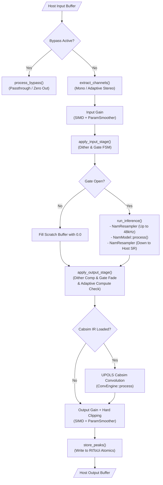

<!--
SPDX-License-Identifier: GPL-3.0-or-later
Copyright (c) 2026 Fábio Henrique de Lima Silva (fhl.bsb@gmail.com) All rights reserved.
-->

# NAM-Plug Architecture: CLAP Plugin

This document is the primary architecture bible and source of truth for **NAM-Plug**, a Neural Amp Modeler (NAM) audio plugin built on the CLAP (CLever Audio Plug-in) specification for Linux.

NAM-Plug wraps the low-latency DSP neural inference engine provided by the [`NeuralAmpModeler-rs`](https://github.com/fabiohl/NeuralAmpModeler-rs) library crate into a production-grade CLAP plugin. It handles plugin lifecycle, DAW parameter automation, lock-free real-time audio processing, state persistence, host extension compliance, and an immediate-mode graphical user interface.

For deep microarchitectural details on neural model execution (WaveNet, LSTM, ConvNet, Linear), SIMD kernels (AVX2/AVX-512), resampler sinc math, oversampling half-band FIR filters, or model loading formats (`.nam`/`.namb`), see the core engine documentation in [`NeuralAmpModeler-rs`](https://github.com/fabiohl/NeuralAmpModeler-rs).

---

## 1. System Topology & Thread Model

NAM-Plug enforces strict thread segregation to guarantee Real-Time (RT) safety during audio processing while supporting interactive UI rendering and host DAW commands.

```text
┌─────────────────────────────────────────────────────────────────────────────┐
│                            DAW Host Environment                             │
└──────┬──────────────────────────────────┬───────────────────────────┬───────┘
       │ (C-ABI Extensions)               │ (process() Callback)      │ (Host Window)
       ▼                                  ▼                           ▼
┌─────────────────────────────┐  ┌─────────────────────────┐  ┌────────────────────────┐
│        Main Thread          │  │    Audio Thread (RT)    │  │       GUI Thread       │
│  - Plugin Lifecycle         │  │  - Hard RT Contract     │  │  - baseview Event Loop │
│  - Parameter Scanning       │  │  - Zero Heap Alloc      │  │  - egui v0.36 / glow   │
│  - State Save / Load        │  │  - Zero Mutex Locks     │  │  - OpenGL 3.3 Render   │
│  - Background Model Loading │  │  - Zero Blocking I/O    │  │  - Async rfd File Dialog│
│  - GC Tier 1 Disposal       │  │  - DSP Signal Chain     │  │  - 5-Zone UI Layout    │
└──────────────┬──────────────┘  └────────────▲────────────┘  └───────────┬────────────┘
               │                              │                           │
               │ SPSC Command Queues          │ Atomics & Peak Telemetry  │
               └──────────────────────────────┴───────────────────────────┘
```

### 1.1 Thread Roles & Hard Contracts

- **Main Thread (Host)** — Plugin lifecycle (`init`, `activate`, `deactivate`, `destroy`), parameter scanning, DAW project state save/load, background model (`.nam`/`.namb`) loading, IR reading via `src/loader/`, and Tier 1 Garbage Collection disposal.

- **Audio Thread (RT)** — Driven by the host `process()` callback (`PluginAudioProcessor::process` in `src/clap/processor/mod.rs`).

  > **Hard Real-Time Contract:** Zero heap allocations, zero mutex locks, zero blocking I/O, zero panics. Operates directly on host audio buffers using host-driven single-callback processing (no PipeWire `DspBridge` required).

- **GUI Thread** — Dedicated `baseview` X11 event loop thread driving an `egui`/`glow` OpenGL renderer (`src/clap/gui/`). Fully isolated from the audio thread.

---

## 2. Compilation Strategy & Feature Flags

NAM-Plug source code (`src/`) is structured to separate CLAP plugin infrastructure from the standalone PipeWire host binary:

- **CLAP Plugin Library (`cargo build --no-default-features --features clap-plugin --lib`):**
  Compiles the `.clap` shared library artifact with embedded GUI support (`src/clap/gui/`). Omits `src/standalone/` (PipeWire client, RT thread pin setup, CLI parsing), keeping the dynamic library free of PipeWire runtime dependencies.
- **Standalone Binary (`cargo build`):**
  Compiles the standalone PipeWire executable (`standalone` feature default). Omits `src/clap/gui/` and CLAP host extension wrappers.

All GUI code lives under `src/clap/gui/` and is conditionally compiled with `#[cfg(feature = "clap-plugin")]`.

---

## 3. Plugin Descriptor & Parameter Surface

### 3.1 Plugin Descriptor

Returned by `nam_descriptor()` (`src/clap/descriptor.rs`) during host scan without heap allocation:

| Field        | Value                                                              |
|:------------ |:------------------------------------------------------------------ |
| **ID**       | `br.eti.fabiolima.nam-plug`                                        |
| **Name**     | `NAM-rs`                                                           |
| **Vendor**   | `Fabio Lima`                                                       |
| **URL**      | `https://github.com/fabiohl/nam-rs`                                |
| **Features** | `["audio-effect", "distortion", "gate", "mono"]` (CLAP 1.2.2 spec) |

Core DSP neural inference is mono by definition. Buffer extraction and VU metering adapt dynamically to mono or stereo host track configurations.

### 3.2 Parameter Surface Catalog

Exposed via `NamPluginParams` (`src/common/params.rs`) and registered in `src/clap/extensions/params/`. Parameter IDs are `u32` constants (`PARAM_*`, 0–8):

| Parameter                | ID                         | Type    | Range / Options                     | Description                                               |
|:------------------------ |:-------------------------- |:------- |:----------------------------------- |:--------------------------------------------------------- |
| **Input Gain**           | `input_gain_db` (0)        | dB      | `-20.0` to `+20.0`                  | Pre-inference gain, sample-accurate smoothed.             |
| **Output Gain**          | `output_gain_db` (1)       | dB      | `-20.0` to `+20.0`                  | Post-inference gain, sample-accurate smoothed.            |
| **Gate Threshold**       | `gate_threshold_db` (2)    | dB      | `-100.0` to `0.0`                   | Noise-gate opening threshold.                             |
| **Bypass**               | `bypass` (3)               | Binary  | `false` / `true`                    | Disables neural processing (dry passthrough).             |
| **Active Model**         | `active_model` (4)         | String  | Read-only                           | Filename of currently loaded model.                       |
| **Adaptive Compute**     | `adaptive_compute` (5)     | Stepped | `Off`, `Conservative`, `Aggressive` | CPU-based dynamic degradation FSM.                        |
| **Slim Override**        | `slim_override` (6)        | Stepped | `Auto`, `ForceFull`, `ForceLite`    | Slimmable A2 container submodel selection.                |
| **Oversampling**         | `oversample` (7)           | Stepped | `Off`, `2x`, `4x`                   | Activation oversampling factor.                           |
| **Activation Precision** | `activation_precision` (8) | Stepped | `Standard`, `Fast`                  | Math mode (`Standard` exact-grade / `Fast` Padé-minimax). |

Model file paths (`.nam`/`.namb`) and Cabsim IR file paths (`.wav`) are managed as **DAW State Properties** (`clap_plugin_state`), enabling project-level serialization and restoration.

---

## 4. CLAP Extensions Framework

Registered in `declare_extensions()` (`src/clap/plugin/mod.rs`) via `clack-extensions`:

| Extension                      | Reference File                            | Purpose                                                                                    |
|:------------------------------ |:----------------------------------------- |:------------------------------------------------------------------------------------------ |
| `clap_plugin_audio_ports`      | `src/clap/extensions/audio_ports.rs`      | Mono input/output audio ports, in-place processing pair enabled.                           |
| `clap_plugin_params`           | `src/clap/extensions/params/`             | Parameter mapping, DAW automation, gesture tracking, and `flush()`.                        |
| `clap_plugin_state`            | `src/clap/extensions/state.rs`            | DAW project state serialization (parameters + model path + IR path).                       |
| `clap_plugin_state_context`    | `src/clap/extensions/state_context.rs`    | Context-aware state restore (distinguishes portable preset vs project duplicate).          |
| `clap_plugin_latency`          | `src/clap/extensions/latency.rs`          | Dynamic latency reporting (resampler + oversample + cabsim total delay).                   |
| `clap_plugin_track_info`       | `src/clap/extensions/track_info.rs`       | Host track color synchronization to GUI accent theme.                                      |
| `clap_plugin_remote_controls`  | `src/clap/extensions/remote_controls.rs`  | "Main" and "Gate" control pages for hardware controllers / device panels.                  |
| `clap_plugin_param_indication` | `src/clap/extensions/param_indication.rs` | GUI visual cues for mapped/automated/overridden parameter status.                          |
| `clap_plugin_preset_load`      | `src/clap/extensions/preset_load.rs`      | Direct model loading (`.nam`/`.namb`) from host preset browser.                            |
| `clap_plugin_render`           | `src/clap/extensions/render.rs`           | Offline render detection. Forces `AdaptiveCompute::Off` + `Standard` activation precision. |
| `clap_plugin_gui`              | `src/clap/extensions/gui.rs`              | Native `egui` windowing via `baseview` (`CLAP_WINDOW_API_X11`).                            |

A separate **Preset Discovery Factory** (`src/clap/factory/preset_discovery.rs`) indexes local models in `~/.nam/models` with extracted metadata so hosts can list them natively.

---

## 5. Lock-Free Communication & RT Safety Architecture

Shared cross-thread state is anchored in `NamClapShared` (`src/clap/plugin/shared.rs`). The audio thread hot-path uses **zero mutexes, zero locks, and zero allocations** — relying exclusively on atomics and lock-free SPSC channels (`rtrb`).

```text
┌─────────────────────────────────────────────────────────────────────────────┐
│                          NamClapShared Allocation                           │
├─────────────────────────────────────────────────────────────────────────────┤
│  #[repr(align(128))] RtToUi      (RT Thread -> UI Reads)                    │
│    - ui_peak_l / ui_peak_r, ui_clipped, active_channel_count, latency      │
├─────────────────────────────────────────────────────────────────────────────┤
│  #[repr(align(128))] UiToRt      (UI Thread -> RT Reads)                    │
│    - 8 Parameter Atomics, gesture_flags, gui_param_generation              │
├─────────────────────────────────────────────────────────────────────────────┤
│  #[repr(align(128))] ColdShared  (Main / UI / RT Setup)                     │
│    - SPSC Command Queues, pending_model payload, IR state, alive_fence      │
└─────────────────────────────────────────────────────────────────────────────┘
```

### 5.1 Cache-Line Isolation (`#[repr(align(128))]`)

To eliminate CPU cache-line bouncing (False Sharing) between the high-frequency audio thread (reading/writing every block) and the UI/Main threads:

- **`RtToUi`** — Dedicated 128-byte aligned cache line for telemetry written by RT (`ui_peak_l`, `ui_peak_r`, `ui_clipped`, `current_latency`, `active_channel_count`).
- **`UiToRt`** — Dedicated 128-byte aligned cache line for parameters written by UI (`input_gain_db`, `output_gain_db`, etc.) and the `gui_param_generation` counter.
- **`ColdShared`** — Dedicated 128-byte aligned structure for low-frequency channels and lifecycle flags (`alive_fence`, pending payloads).

### 5.2 Generation-Counter Parameter Synchronization

To prevent loading 8 atomic floats on every audio block when parameters are stationary:

1. UI/Main updates parameter atomics and executes `fetch_add(1, Release)` on `gui_param_generation`.
2. Audio thread performs a single `Acquire` load of `gui_param_generation`. If unchanged, per-parameter reads are skipped. If incremented, it reads parameter targets with `Relaxed` ordering and passes them to `ParamSmoother`.

### 5.3 Three-Tier Real-Time Garbage Collection Cascade

Deallocating complex DSP structures (`Box<StaticModel>`, `Box<NamResampler>`, `ConvEngine`, `OversampleEngine`) on the audio thread causes kernel allocator locks and priority inversion. Disposal cascades through three lock-free tiers (`gc_cascade` in `NeuralAmpModeler-rs/src/common/spsc/gc.rs`):

```text
RT Thread (Replaced Asset)
       │
       ▼
[Tier 1: SPSC gc_tx (32 slots)] ──────► Drained by Main Thread (housekeeping)
       │ (if full)
       ▼
[Tier 2: Processor Parking Lot (16 slots)] ──► Flushed back to SPSC next block;
       │                                          single-owner handoff on deactivate
       │ (if full)
       ▼
[Tier 3: GcOverflowBuffer Atomic Ring] ────► Controlled Leak + Sets RT_STATUS_GC_OVERFLOW
```

1. **Tier 1 (SPSC GC Queue):** Push to `gc_tx` (32 slots). Main thread drains and drops objects during periodic `housekeeping()` via `drain_gc_channels(consumer, overflow, parking_lot, rt_status)`.
2. **Tier 2 (Processor Parking Lot):** Fixed array `[Option<GcItem>; 16]` inside `PluginAudioProcessor`. `gc_cascade` flushes items parked in previous cycles back to the SPSC whenever capacity frees, and the processor retries once per audio block (`drain_parking_lot`), so parked items reach the off-RT drain during normal operation. At teardown the lot is never dropped with the processor: `deactivate()` hands `&mut parking_lot` to `drain_gc_final()` (single-owner handoff after the audio thread stopped), so one canonical drain releases SPSC + overflow + the 16 slots on the main thread.
3. **Tier 3 (`GcOverflowBuffer`):** Atomic ring buffer (`SPSC_CAPACITY`). Overwrites oldest slot if completely saturated, setting `RT_STATUS_GC_OVERFLOW` to preserve RT deadline execution.

### 5.4 FFI Lifetime Safety & Panic Guard

- **`alive_fence` (`Arc<AtomicBool>`):** Background file picker threads check `alive_fence` before dereferencing shared pointers, preventing use-after-free (UAF) if the host destroys the plugin while a dialog is open.
- **`GuiHostBridge` (`src/clap/gui/mod.rs`):** Safe wrapper storing raw host pointers as `NonNull<()>` and reconstructing `HostSharedHandle<'static>` on demand, reflecting the CLAP spec guarantee that the host outlives the plugin.
- **C-ABI Panic Protection:** `install_panic_hook("clap")` sets the crash reporter. Any Rust panic crossing C-ABI host boundaries is caught to prevent Undefined Behavior (UB), returning clean early failure codes.

### 5.5 Deferred Model Load (`pending_model`)

When DAW state is restored prior to `activate()`, the host buffer size (`max_frames_count`) is unknown. The model payload is cached in `ColdShared::pending_model` and flushed via `flush_pending_model()` during `activate()` (primary) or initial `housekeeping()` before the audio thread processes frames.

### 5.6 Channel Preservation on `deactivate()`

Calling `deactivate()` returns SPSC channel consumers (`param_rx`, `gc_tx`, `slimmable_rx`) back into `ColdShared`, allowing hosts to stop and restart audio processing without instance recreation or memory reallocation. Before the processor drops, `deactivate()` also performs the GC parking-lot handoff (see §5.3): the 16-slot RT array is passed by mutable reference to `drain_gc_final()` so every in-flight `GcItem` is released off-RT through the canonical drain.

---

## 6. DAW Audio Processing & DSP Pipeline

The audio thread entry point `PluginAudioProcessor::process()` (`src/clap/processor/mod.rs`) executes the signal chain:



### 6.1 Execution Sequence

1. **Subnormal & Denormal Setup:** First block enables Flush-To-Zero (FTZ) and Denormals-Are-Zero (DAZ) via SSE control registers.
2. **Event & Command Draining (`process_events()`):** Drains SPSC `param_rx` (model swaps, IR swaps, oversampling rebuilds), drains DAW sample-accurate event queues, and updates local parameter targets.
3. **Channel Extraction (`extract_channels()`):** Maps host input buffers into contiguous working scratch buffers. Counts active channels (`1` or `2`) for adaptive metering.
4. **Input Gain & Stage:** Applies user input gain (SIMD + `ParamSmoother`), injects `-220 dBFS` anti-subnormal dither, and evaluates the Noise Gate FSM.
5. **Neural Inference Execution (`run_inference()`):**
   - Upsamples host rate to 48 kHz native via minimum-phase polyphase `NamResampler` (bypassed if host rate is 48 kHz).
   - Executes `NamModel::process()` (with optional 2x/4x oversampling around neural activations).
   - Downsamples 48 kHz back to host sample rate via `NamResampler`.
6. **Output Stage & Degradation Check:** Compensates dither, applies linear gate fade-in/out ramps, and checks audio block deadlines for `AdaptiveCompute` CPU fallback.
7. **Cabsim IR Stage (Optional):** Executes Uniform-Partitioned Overlap-Save (UPOLS) frequency-domain convolution (`ConvEngine::process()`) if an IR file is loaded.
8. **Output Gain & Clipping:** Applies user output gain (SIMD + `ParamSmoother`), enforces hard clipping at `+0 dBFS` if enabled, and writes peak telemetry to `RtToUi` atomics.

### 6.2 Model Gain Calibration Isolation

NAM models supply embedded metadata (`input_level_dbu`, `loudness`). The loader computes calibration adjustments (`input_mult_adj`, `output_mult_adj`). In NAM-Plug, calibration multipliers are passed via `DspPipelineContext::input_gain_mult`/`output_gain_mult` separately from `smoother_in`/`smoother_out`. This ensures sample-accurate DAW user-gain automation never alters underlying static model loudness calibration.

---

## 7. Graphical User Interface (GUI Architecture)

The graphical interface is built using an immediate-mode paradigm under `src/clap/gui/`.

```text
┌─────────────────────────────────────────────────────────────────────────────┐
│                       NAM-Plug egui GUI Architecture                        │
├─────────────────────────────────────────────────────────────────────────────┤
│  5-Zone UI Layout (draw_ui)                                                 │
│    Zone 1: Identity Bar (Brand, Active Model Readout, Load Buttons)         │
│    Zone 2: Controls Grid (Input / Output Gain, Gate Threshold, Options)     │
│    Zone 3: Meters Section (Adaptive VU Meter: Single Bar / Stereo Bars)     │
│    Zone 4: Bypass Toggle                                                    │
│    Zone 5: Status Bar (Orchestrator, Telemetry, A2 Slim Controls)           │
├─────────────────────────────────────────────────────────────────────────────┤
│  Rendering Pipeline: egui v0.34 ──► egui_glow / glow v0.17 (OpenGL 3.3)     │
├─────────────────────────────────────────────────────────────────────────────┤
│  Windowing: baseview (Native Embedded X11 Window / RawWindowHandle 0.6)     │
├─────────────────────────────────────────────────────────────────────────────┤
│  Async File Picker: rfd (Background Thread File Dialog, Non-Blocking)       │
└─────────────────────────────────────────────────────────────────────────────┘
```

### 7.1 Module Organization

- `src/clap/gui/mod.rs` — GUI entry point, window dimensions (`600x275`), `GuiHostBridge`.
- `src/clap/gui/window/state.rs` — `NamPluginWindow`: GL context initialization, `egui_glow` painter setup, GLSL shader compilation, theme initialization, teardown.
- `src/clap/gui/window/handler.rs` — `WindowHandler`: `on_frame`/`on_event`, baseview translation to `egui::RawInput`, drag-and-drop model loading, frame rendering.
- `src/clap/gui/window/shaders.rs` — GLSL vertex and fragment shaders for hardware-accelerated VU rendering.
- `src/clap/gui/ui/mod.rs` — 5-Zone UI layout orchestrator (`draw_ui`).
- `src/clap/gui/ui/zones/` — Zone implementations: `identity` (Z1), `controls` (Z2), `meters` (Z3), `bypass_zone` (Z4).
- `src/clap/gui/ui/status_bar/` — Zone 5 status bar (`orchestrator`, `telemetry`, `metadata`).
- `src/clap/gui/ui/meter/` — VU metering logic: `orchestrator`, `glow` (GPU hardware path), `cpu` (fallback path).

### 7.2 Two-Tier Frame Lifecycle & Idle Skip (CLAP-F022)

To prevent idle CPU consumption when the plugin UI is open but static:

- **Tier 1 (Idle Early-Exit):** Executed before acquiring the GL context or running `egui`:

  ```rust
  if !self.dirty && !self.state.has_active_animations() && !peaks_changed {
      return; // Early exit: 0% GL/CPU cost
  }
  ```

  Returns immediately if no input events occurred (`!dirty`), no UI animations/toasts are active, and audio peaks are stationary.

- **Tier 2 (Repaint Throttle):** Repaint driver requests 33 ms repaints only when VU meters are active or animations are running.

### 7.3 Adaptive VU Metering

The UI reads `RtToUi::active_channel_count` (`1` or `2`) updated by the audio thread:

- **Mono Track:** Renders one centered 76 px wide VU bar.
- **Stereo Track:** Renders dual 36 px wide Left/Right VU bars.

Custom GLSL shaders (`shaders.rs`) render rounded 3-color dB gradient bars (green $\le -12$ dBFS, yellow $-12 \to -3$ dBFS, red $-3 \to +6$ dBFS) with dynamic peak-hold lines. If GL shader compilation fails, rendering automatically falls back to flat mesh rectangles (`meter/cpu.rs`).

### 7.4 Floating Window Lifecycle & Reaper Pattern (`nam-gui-reaper`)

When closing a floating window:

1. `gui.destroy()` sets `close_signal = true`.
2. Rather than blocking the main thread or abandoning detached threads (which caused UAF vectors in earlier architectures), a lightweight background thread named `nam-gui-reaper` is spawned.
3. `nam-gui-reaper` joins the window handle asynchronously in the background while the main thread returns immediately to the host DAW.

---

## 8. Error Catalog Summary (`NamErrorCode`)

NAM-Plug utilizes typed diagnostic codes (`NamErrorCode` in `NeuralAmpModeler-rs/src/common/diagnostics/error_codes.rs`) for structured logging and UI error toasts:

| Range   | Category            | Representative Examples                                                                                             |
|:------- |:------------------- |:------------------------------------------------------------------------------------------------------------------- |
| `E1xxx` | Model Loading & I/O | `E1100` FILE_NOT_FOUND, `E1200` NAM_JSON_PARSE_ERROR, `E1201` NAMB_CRC32_MISMATCH, `E1300` UNSUPPORTED_ARCHITECTURE |
| `E2xxx` | Audio & Real-Time   | `E2001` DEADLINE_EXCEEDED, `E2200` RESAMPLER_BUILD_FAILED, `E2300` SCHED_FIFO_DENIED                                |
| `E3xxx` | SPSC / Lock-Free GC | `E3100` PARAM_CHANNEL_FULL, `E3101` GC_OVERFLOW, `E3102` GC_CORRUPTED                                               |
| `E4xxx` | Runtime & CLI       | `E4100` INVALID_GAIN_VALUE, `E4103` IR_LOAD_FAILED                                                                  |
| `E5xxx` | System Resources    | `E5000` OUT_OF_MEMORY                                                                                               |

---

## 9. Test Infrastructure & Contract Validation

Automated CLAP integration testing and specification validation are implemented across four dedicated testing layers:

### 9.1 Host Harness (`src/clap/host_harness.rs`)

A fully functional simulated DAW host environment built within library unit tests:

- `CompleteHostState` — Shared event log (`Arc<Mutex<Vec<HostEvent>>>`) and assertion flags.
- `CompleteHostShared` / `CompleteHostMainThread` / `CompleteHostAudioProcessor` — Implements all 6 standard CLAP host extensions (`audio-ports`, `params`, `state`, `latency`, `track-info`, `render`).
- Helper utilities (`make_test_plugin_with_harness()`, `process_block_harness()`, `perform_restart()`) test deactivate/activate cycles, state migration, and parameter automation directly in Rust unit tests.

### 9.2 Dynamic Artifact Validator (`tests/clap/artifact_validator.rs`)

Integration tests dynamic-link against the compiled `.so` binary using `PluginEntry::load(&artifact.path)` rather than static linking, asserting ABI symbol compliance and recording SHA256 binary hashes for CI traceability.

### 9.3 Headless GUI Testing (Xvfb)

Floating window lifecycle (`create` $\to$ `set_transient` $\to$ `destroy`) and clipboard integration (`arboard`) are validated under a headless virtual X11 display (`Xvfb :99`) with Mesa software rendering (`llvmpipe`), executed on-demand (manually or in extended CI) since they require the Xvfb headless display stack.

### 9.4 E2E CLAP vs NAMCore Parity (`tests/clap/clap_parity_multi_sr.rs`)

Loads `.so`, loads target models via CLAP state, processes stress signals across irregular buffer sizes, and compares output against the reference C++ NAMCore oracle with conservative gates `ESR < 1e-8`, `SNR > 80 dB` (measured 2026-08-13: ESR ≈ 7.9e-12 / 111 dB). Runs under `utils/tests-quick.sh` Phase 2 (release-only scope, S6-T04 / RES-04) when the C++ render binary, the release `.so` and the model fixture are present; otherwise reported as an explicit GAP.

---

## 10. References

- [`NeuralAmpModeler-rs`](https://github.com/fabiohl/NeuralAmpModeler-rs) — Neural Amp Modeler DSP engine library.
- [CLAP (CLever Audio Plug-in) Specification](https://cleveraudio.org/) — Official CLAP plugin format documentation.
- [Clack Framework](https://github.com/prokopyl/clack) — Safe Rust bindings for CLAP plugins and hosts.
- [NeuralAmpModelerCore](https://github.com/sdatkinson/NeuralAmpModelerCore) — Reference C++ implementation of NAM.
